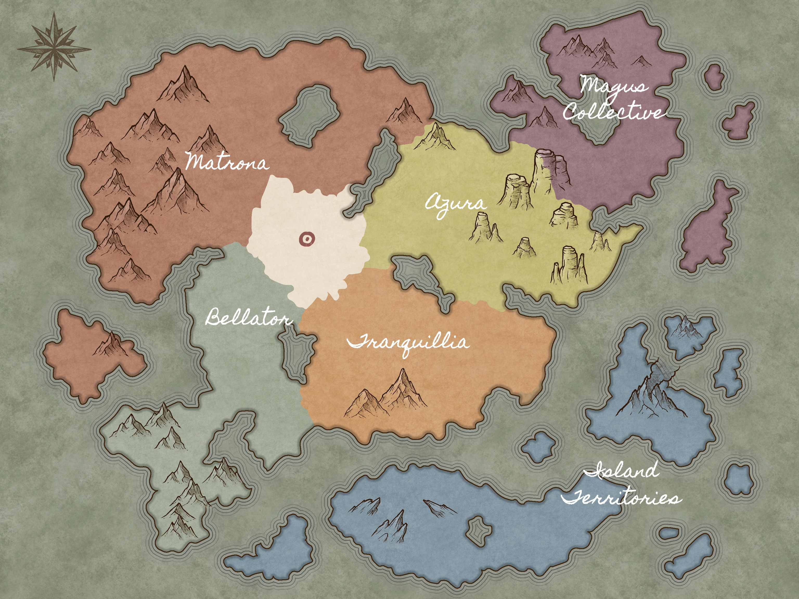

# 🔥 chertia

### 📚 Documentation

Welcome to the Chertia documentation. Here, you will find a plethora of information about the community, the server, and the lore of Chertia. All page links can be found in the sidebar.

### 🧭 Quick Access

<table data-view="cards"><thead><tr><th></th><th data-hidden data-card-target data-type="content-ref"></th><th data-hidden data-card-cover data-type="files"></th></tr></thead><tbody><tr><td><strong>🧑‍⚖️ Rules</strong></td><td><a href="structure/rules.md">rules.md</a></td><td><a href=".gitbook/assets/2023-04-12_20.15.39.png">2023-04-12_20.15.39.png</a></td></tr><tr><td><strong>💻 Commands</strong></td><td><a href="guides/commands.md">commands.md</a></td><td><a href=".gitbook/assets/2023-03-10_01.45.38.png">2023-03-10_01.45.38.png</a></td></tr><tr><td><strong>🔋 Modpack (optional)</strong></td><td><a href="other/modpack.md">modpack.md</a></td><td><a href=".gitbook/assets/2023-03-10_01.45.14.png">2023-03-10_01.45.14.png</a></td></tr><tr><td><strong>📗 Server Guide</strong></td><td><a href="guides/server-guide.md">server-guide.md</a></td><td><a href=".gitbook/assets/2023-02-25_14.29.11.png">2023-02-25_14.29.11.png</a></td></tr><tr><td><strong>📘 Lore Guide</strong></td><td><a href="guides/lore-guide.md">lore-guide.md</a></td><td><a href=".gitbook/assets/2023-03-10_21.13.55.png">2023-03-10_21.13.55.png</a></td></tr><tr><td><strong>📒 Character Guide</strong></td><td><a href="guides/character-guide.md">character-guide.md</a></td><td><a href=".gitbook/assets/2023-03-09_20.38.00.png">2023-03-09_20.38.00.png</a></td></tr><tr><td>💬 <strong>Chat</strong></td><td><a href="guides/chat.md">chat.md</a></td><td><a href=".gitbook/assets/2023-04-11_19.51.45.png">2023-04-11_19.51.45.png</a></td></tr><tr><td>🗺️ <strong>Server Map</strong></td><td><a href="https://map.chertia.com">https://map.chertia.com</a></td><td><a href="broken-reference">Broken file</a></td></tr></tbody></table>

### 🗺️ Map of Divian

Divian is the world in which our story takes place.

<figure><figcaption></figcaption></figure>
