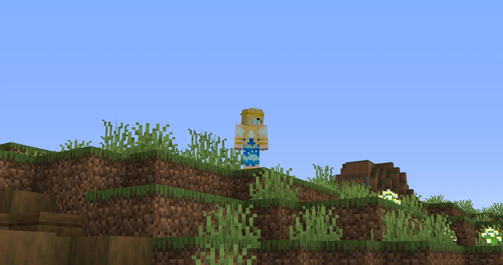
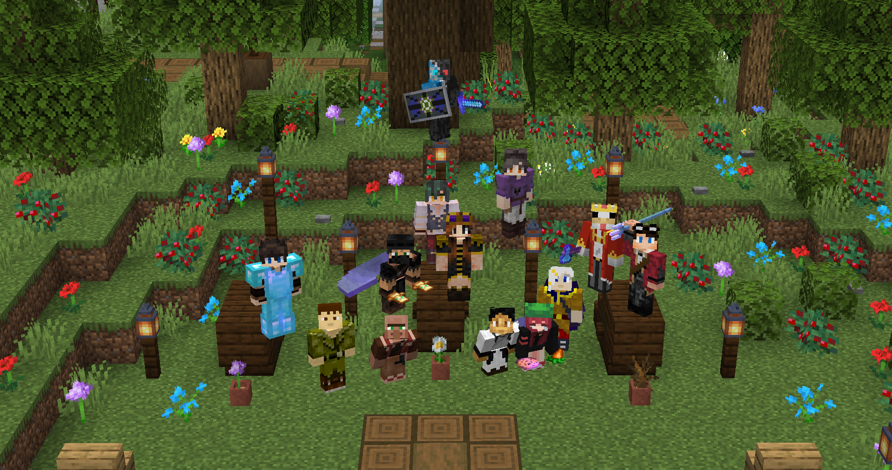
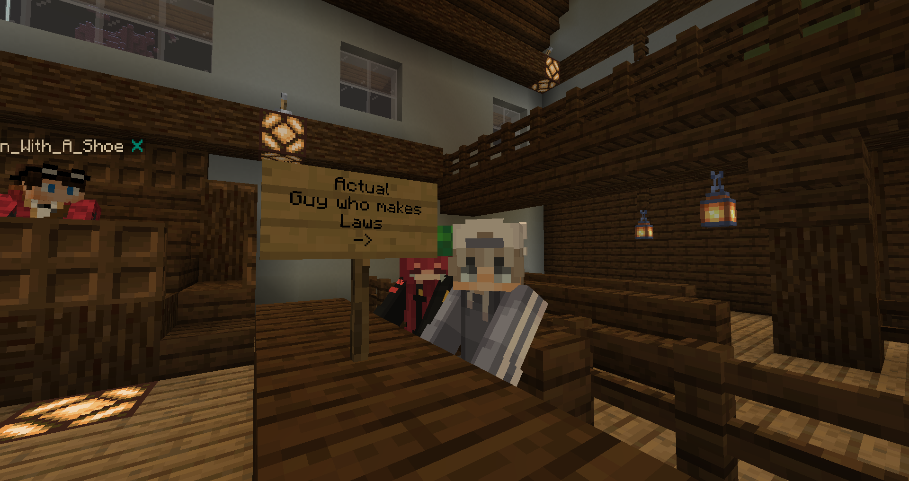
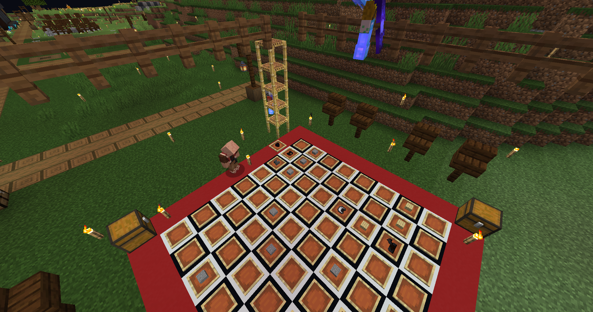

# Season 1

* **📆 Date:** January 10, 2020 - July 10, 2020
* 📍 **Location:** Bluebell, Chertia


With a total refresh of the Chertia canon at the start of 2020, Season 1 served as a reimagining of the story originally told in 2015.

In Seasons 1-4, each player character arrived from a separate "world" other than Divian, many of them unwillingly. Their desire to either find a new home in Divian or return to their home world was a motivation for many characters.


***

<figure><figcaption></figcaption></figure>

## Part 1: "Welcome to Chertia"

### Chapter 1: "Welcome to Chertia"

_January 10, 2020_

The players arrive in the **Bluebell** province of the Kingdom of Chertia, disoriented and unsure of their surroundings. As they explore the area and gather resources, they meet **Lady** **Chertia**, a woman who reveals herself as the Goddess of Kindness. She is curious about how the players arrived, having detected a magical signal leading her to them. The players, however, are unable to explain their sudden appearance. During their conversation, a man named **Lord** **Syenite** appears, introducing himself as the God of Chaos and Chertia's brother. Tension arises as Chertia asks Syenite to leave, but he refuses. The situation becomes more complex when **Lady** **Mylonite**, the Goddess of Balance (and the two gods' other sibling), arrives. Chertia explains to Mylonite that the players' teleportation to the province triggered the magic signal she detected.

Syenite, suspicious of the players, contemplates imprisoning them but eventually agrees to let them stay as long as they avoid certain areas. Chertia reveals that the Bluebell is home to their most valuable possessions, including their **Cores**, which contain their magic and soul. She explains that while mortals can touch the Cores, they cannot take or use them. Syenite, bored, leaves after dismissing the players. Chertia hints at a growing conflict between her and Syenite over the kingdom's future.

Chertia suggests that the players could assist with a project in the province by gathering materials for construction. After Chertia leaves, Mylonite stays behind to continue interacting with the players as they collect resources and build settlements. Syenite later returns alone, revealing more about the gods' troubled upbringing and sharing his views on devotion and the kingdom's future. He hints at a plan to restore the kingdom's glory through its magical energy, while criticizing Chertia for being overly kind and misguided in her rule.

Syenite's conversation with the players deepens the understanding of the conflict between the gods. He explains that Chertia, as the eldest, holds the "dominant core" and can control the kingdom's magical energy. Although Syenite does not intend to start a war, he does not rule out the possibility if their disagreements escalate. He emphasizes that any power struggle between the gods would not involve mortals directly, as per "divine law". After sharing his thoughts on the nature of cores and their resilience, Syenite leaves the players to continue their activities in the province.

### Chapter 2: "Path of Devotion"

_January 15, 2020_

Syenite boldly claims the province for himself. Chertia, angered by his audacity, attacks him with a lightning spell and traps him in a blue barrier. She declares her intention to lock him away, tired of his interference, despite Mylonite's concerns that this course of action may not be right. Chertia proposes that, while she should maintain control over the kingdom & province, she could give Syenite a small portion of land in Bluebell. However, Syenite demands equal control, which Chertia dismisses as unreasonable.

As the confrontation escalates, Syenite breaks free from Chertia's barrier using a sword and his own magic. He traps Chertia in a red barrier, turning her magic against her. Mylonite protests, but Syenite, like Chertia, ignores her. Chertia eventually breaks free, but Syenite reveals that his plan has succeeded, having combined their magic to give him an advantage over her. Chertia, realizing that this means war, warns that the conflict will not end well for either of them before departing. Syenite also leaves, warning the players not to interfere, though he won't hesitate to fight them if necessary. Mylonite remains behind, discussing the situation with the players and expressing her hopes for a swift resolution, though she has a bad feeling about the impending war.

Afterward, Mylonite takes the players to a shrine near her core, where she teaches them about devotion. Kira offers to devote herself to Mylonite, initially sacrificing a prized tool and then proposing to make Mylonite the god of her kingdom, Kirtia. Mylonite accepts, completing the devotion ritual. Another player, Angel, also devotes himself to Mylonite, offering an enchanted trident. Mylonite explains the benefits and obligations of devotion, including the soul-bound divine item that remains with a devotee after death. She then advises the players to prepare for the potential war, emphasizing the need for proper armor and weapons, before leaving them to ready themselves for the uncertain times ahead.

### Chapter 3: "In Motion"

_January 17, 2020_

Mylonite and Syenite arrive, arguing over the escalating war, with Mylonite urging Syenite to ease off, but he refuses. Instead, Syenite shifts the conversation to his need to visit The End, and invites the players to accompany him. They activate a nearby portal and enter The End, where they quickly defeat a large dragon before moving on to the outer islands. Syenite collects four bottles of dragon's breath and, after thanking the players for their assistance, departs.

### Chapter 4: "Chertia & Syenite"

_January 24, 2020_

In a tense exchange, the gods Chertia and Syenite continue their conflict, with Mylonite caught in the middle. Syenite reveals that he has secretly deactivated Chertia's core, effectively removing her from power. Mylonite, while hesitant, supports this drastic action, believing it necessary to restore balance. The players, confused and concerned, question Mylonite's decision to side with Syenite, especially given the history of their past conflicts that ended disastrously when power was equally divided among gods.

Despite Chertia’s warnings about repeating past mistakes, Mylonite and Syenite remain firm in their decision, leaving the players uneasy about the future. Syenite plans to hide Chertia's core, with Mylonite insisting on knowing its location to ensure balance. The players, particularly Ace, express their doubts and concerns about the situation, but ultimately, Syenite dismisses their input, asserting control over the events. Mylonite agrees to keep an eye on the situation, hinting at future plans to restore balance and resolve the brewing conflict.

### Chapter 5: "Illusions of Power"

_January 31, 2020_

Syenite's dismissive attitude toward the problems at hand, such as the resistance forming against his rule and the unresolved tension with Chertia, raises suspicions among the players.

The situation escalates when Mylonite arrives, questioning Syenite's decisions and expressing concern over his disregard for the brewing conflict. Mylonite shifts the group to a courtroom where the players, now jurors, must decide Syenite’s fate regarding the custody of Chertia’s core. Despite his attempts to manipulate the situation, including dismissing his lawyer and planting evidence on a player, the jury finds Syenite guilty. Mylonite demands the core, but Syenite refuses to relinquish it, leading to a heated exchange and a final act of defiance as he sets part of the town on fire before abruptly leaving.

In the aftermath, Mylonite, concerned about her brother's deteriorating mental state, reveals to the players that Syenite is likely being corrupted by Chertia's core. She proposes a risky plan to push Syenite to the brink, hoping that by angering him further, he will recognize his own corruption and lose control over his magic. Mylonite enlists the players' help in this endeavor, appealing to even Syenite's followers by urging them to see that their god is no longer in control of his actions.

<figure><figcaption>
Artwork of Syenite by Tazlings.
</figcaption></figure>

### Chapter 6: "The War"

_February 7, 2020_

Syenite arrives, greeted with mixed reactions from the players. Though some express loyalty, others are skeptical and even confrontational, noting a further change in his appearance and demeanor. Syenite begins by updating the players on his efforts to stabilize magic within the realm, introducing the concept of “divine enchantments.” However, he quickly reveals his true intentions, expressing a desire to burn down the town, which sparks concern and tension among the players. Despite attempts to engage him in dialogue, Syenite’s unstable nature becomes increasingly apparent, leading to a chaotic atmosphere where the players prepare for a potential confrontation.

The players mock Syenite's reliance on these cores, attempting to provoke him into a mistake. This strategy is risky, but they persist, hoping to weaken Syenite’s resolve. The appearance of Mylonite adds a new dynamic, as she deactivates Syenite’s core, leaving him dependent on the unstable power of Chertia’s core. This further destabilizes Syenite, but he remains defiant, warning the players that the outcome will not be favorable for them.

Mylonite’s intervention has temporarily weakened Syenite, but the uncertainty of Chertia’s fate and the unpredictable nature of Syenite’s actions leave everyone on edge, knowing that a more dangerous confrontation is inevitable.

<figure><figcaption></figcaption></figure>

***

## Part 2: "The Shadows"

### Chapter 7: "Home"

_February 14, 2020_

Chertia returns, announcing that she has just come back from The Place Between Worlds. Her arrival is met with greetings and curiosity from other players. As more members join, there is a growing sense of anticipation about what Chertia experienced during her absence.

The tone shifts when Mylonite is summoned by the group. Upon her arrival, she begins to share troubling news. The gods had encountered a mysterious force in The Place Between Worlds, which they refer to as "The Shadows." This force seems to have the ability to counter their magic, creating a sense of unease among the players.&#x20;

The players express concern over the potential threat posed by The Shadows, wondering if they could have followed the gods back to their world. Despite these fears, the gods try to reassure them, explaining that they do not sense any immediate danger. Mylonite mentions that they plan to establish a means of communication between the gods and the players, allowing for better interaction and guidance in the future.

<figure><figcaption></figcaption></figure>

### Chapter 8: "Monster Hunters"

_February 19, 2020_

Mylonite joins the server, greeted warmly by the players who are engaged in casual banter. The mood is light as they exchange greetings, but it shifts when Chertia arrives, mentioning that Syenite will be late. Mylonite then reveals that she and Chertia need the players’ help to address the growing threat of shadow monsters. The gods explain they’ve spent days planning and have decided that the players will need to capture one of the shadow creatures for study. This revelation causes some anxiety among the players, who joke about sacrifices and volunteer themselves in jest. Mylonite explains that the shadow creatures seem to be targeting the players, raising the tension.

The players prepare by gathering weapons and items, following the gods to the designated area. Chertia and Mylonite set up the capture, while the players express their doubts and fears. When they finally succeed in capturing a shadow monster, the situation quickly escalates as the creature begins to resist containment.

Chaos breaks out as the shadow monster breaks free, resulting in several player deaths. The gods manage to regain control, but the incident leaves everyone shaken. Mylonite theorizes that the shadow creatures might be learning from those attempting to control them.

Syenite, who arrives late, suggests a new strategy: collecting shadow shards (which apparently taste delicious according to some of the players) to create a protective spell. The players agree to help gather the materials, feeling a mix of relief and lingering unease.&#x20;

### Chapter 9: "The Shadows"

_February 21, 2020_

Mylonite arrives and explains the necessity of having mortals present for the protective spell, hinting at potential danger. Syenite, joining later, adds to the group's nervousness by pointing out the chaotic nature of the situation.

When the spell begins, it quickly turns chaotic as shadow monsters attack, leading to several player deaths. Despite the chaos, the group manages to hold on, but the spell ultimately fails, opening the gateway further for more powerful monsters to enter their realm.

In the aftermath, the group discusses the implications of the failed spell, with Mylonite and the players expressing concern over the potential for stronger monsters to appear. Meanwhile, a new character, **Oliver**, arrives, revealing that he has come from another world on a mission to find **Lady Scoria** - the sibling gods' other sibling who has been missing for many years - adding another layer of mystery to the unfolding events. Mylonite takes Oliver aside for a private conversation, leaving the players with a mix of curiosity and unease.

<figure><figcaption></figcaption></figure>

### Chapter 10: "Oliver"

_February 26, 2020_

Chertia, Syenite and the players discusses the attempted takeover by Scoria and **Lord Variscite** (another sibling god) many years ago.

Syenite is particularly hostile, especially when discussing Scoria, whom he refuses to forgive for past transgressions. The group prepares to meet Oliver, a mortal associated with Scoria, who appears distressed by Scoria's disappearance and the shadowy forces that may have taken her. Oliver shares his personal connection with Scoria, revealing his desire to find her. His story elicits mixed reactions from the group, with some showing empathy while others remain skeptical.

The players regroup after finding three crystals needed for a spell, discussing the complex history and relationships among the gods, including the revelation of their parentage and the civil war that once divided them. Chertia expresses concern about the calm before the storm, hinting at greater dangers to come. The session concludes with Chertia departing to speak with Oliver, leaving the group to reflect on the challenges ahead and the unresolved conflicts within their ranks.

### Chapter 11: "When Worlds Collide"

_February 28, 2020_

The session starts with Chertia warmly greeted by the players, who are preparing for an upcoming battle against the shadows. Tensions rise as the group discusses the spell they need to perform, with  Mylonite confirming a 95% success rate. Despite their cautious optimism, the ritual quickly descends into chaos, with many players falling to shadow monsters.

As the ritual fails, the group debates Plan B—a drastic measure to cut off their world from others to contain the shadows. The players are unsettled by the idea of permanent isolation, but the threat of the shadows looms large. The tension escalates when Lady Scoria appears. The session ends with a battle against a greyscale Scoria, who is revealed to be under the influence of the shadows. The gods, now missing, leave the group to face an uncertain future, with the shadow threat still looming and the fate of their world hanging in the balance.

<figure><figcaption></figcaption></figure>

### Chapter 12: "Courage"

_March 1, 2020_

Syenite and Mylonite arrive, with Mylonite revealing the absence of Scoria. The group faces a sudden attack by Shadow Monsters, leading to chaos and multiple casualties.

Amidst the battle, Mylonite reveals that they managed to close the rift, but the victory feels hollow as the threat of the Shadows persists. Scoria is implicated as the source of the Shadows, causing a divide among the group on how to handle the situation. The group decides to try and separate Scoria from the Shadows, though the process is fraught with danger, nearly costing the group dearly.

As the dust settles, it becomes apparent that while Scoria is saved, the group remains trapped in their current realm, with no clear way to return to their own worlds.&#x20;

***

## Part 3: "The Lost God"

### Chapter 13: "What Happens Next"

_March 6, 2020_

Lady Mylonite reveals a pressing concern: the realm’s magic, once abundant, is now diminishing. She speculates that this magic isn’t disappearing but is being redirected elsewhere within the realm. This revelation stirs unease among the group, leading to a discussion on how to locate and potentially recover the lost magic. However, the complexity of tracking magic leaves them with more questions than answers.

Amidst the discussions, a deeper conflict surfaces when Syenite expresses disdain for their efforts, dismissing their attempts to assist other realms as futile. This stance sharply contrasts with the others, particularly Faolan and Gameboy, who emphasize the importance of helping those in need, even if they are from different worlds. The group’s frustration with Syenite’s lack of empathy grows, leading to heated exchanges. Eventually, Syenite departs, leaving the others to contemplate their next steps without his support.

As Mylonite begins to experience physical pain linked to the loss of magic, the urgency of their task becomes more apparent. The group realizes they must act quickly to restore the realm’s magic before it’s too late. Despite the tensions and disagreements, they resolve to find a suitable location to centralize the magic and prepare for the difficult journey ahead.


At this point, the COVID-19 pandemic was quickly becoming more and more widespread. With a lot of free time, story events were often held 3-4x a week, and sometimes on a daily basis. A LOT of story was covered in this time. Because of this, there are a lot of twists and turns and changing of directions - I have tried my best to make it easy to follow.


### Chapter 14: "Scouts"

_March 7, 2020_

In a tense confrontation, Mylonite manages to deactivate Syenite’s core, weakening him. However, the situation takes a dramatic turn when it is revealed that Syenite still possesses Chertia’s core, making him unstable and dangerous. Despite their efforts, Syenite’s insanity grows, and the group prepares for another round of conflict. Just when it seems all is lost, Mylonite steps in, stabilizing the situation and reactivating Syenite’s core. Syenite, now free of the core’s corruption, is remorseful for his actions, but the damage to Chertia is severe.&#x20;

The group is relieved when Chertia returns, forgiving Syenite for his actions and deciding to work together to repair the damage done. The reunion is bittersweet as the gods prepare to leave on a dangerous journey to The Place Between Worlds, hoping to find a way to restore the kingdom's magic and send the group back to their homes. However, Syenite is deeply hurt by some choice words from Giron and refuses to help. Lux, inspired by Chertia’s kindness and leadership, devotes himself to her, marking a moment of personal growth and resolution.

<figure><figcaption></figcaption></figure>

### Chapter 15: "The Centralization Spell"

_March 13, 2020_

As Chertia, Mylonite and the players discuss the potential to proceed without all the gods, the group expresses doubts, especially about Giron, who reluctantly agrees to apologize if they indeed need Syenite's help.

The group contemplates drastic measures, including the idea of sacrificing Giron to appease Syenite. Despite the grim humor, they realize the gravity of the situation, especially when Chertia admits she has tried to contact Syenite without success. As tensions rise, they eventually decide to perform a collective prayer to summon Syenite. After multiple attempts, Syenite finally appears, though his initial response is dismissive and mocking. The group apologizes, particularly Giron, who expresses regret for his actions. Syenite, seeing their desperation and the dire state of affairs, agrees to help but with the caveat that their animosity will resume afterward.

The situation takes a dramatic turn when Chertia absorbs the magic meant for all the gods, leaving the group in shock and panic as she abruptly leaves. The group is left to grapple with the aftermath, fearing the potential consequences of this unintended power transfer. As they scramble to understand what just happened and what it means for their future, a sense of dread and uncertainty hangs over them, signaling that their troubles are far from over.

### Chapter 16: "Kindness"

_March 14, 2020_

In a chaotic discussion, the group learns that Chertia has transformed into a pig after sacrificing her physical form and destroying her core. This surprising revelation sparks confusion and concern among the group as they try to piece together what has happened.

As the other gods attempt to re-establish a connection to other worlds, they discover that shadow monsters have begun to pour through, forcing them to cut the connection to avoid further danger.  Scoria suggests seeking help from Oliver, an expert in inter-realm travel, hoping he can assist in safely reopening the connection. Oliver arrives, and after assessing the situation, suggests that Scoria is the best candidate to handle the unstable magic due to her unique understanding of the shadows.

Scoria successfully reopens the connection, but her success is overshadowed by the mysterious disappearance of several gods’ cores, including her own. The group suspects foul play but struggles to identify the culprit. Mylonite reveals that Variscite’s essence is safely contained on her desk at home, ruling him out as a suspect. Despite the rising tension and suspicions, the group decides to investigate traces of magic left at the scene to uncover who might have closed the connection and taken the cores. The event ends with the gods leaving to analyze the magical traces, leaving the group in uncertainty and anticipation of the truth.​
