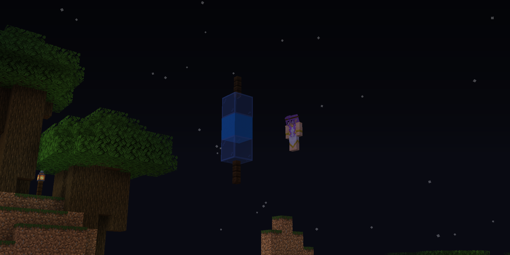

# Season 1

* **📆 Date:** January 10, 2020 - July 10, 2020
* 📍 **Location:** Bluebell, Chertia

***

## Part 1: "Welcome to Chertia"

***

### Chapter 1: "Welcome to Chertia"

_January 10, 2020_

The players arrive in the Bluebell province, disoriented and unsure of their surroundings. As they explore the area and gather resources, they meet Chertia, a woman who reveals herself as the Goddess of Kindness. She is curious about how the players arrived, having detected a magical signal leading her to them. The players, however, are unable to explain their sudden appearance. During their conversation, a man named Syenite appears, introducing himself as the God of Chaos and Chertia's brother. Tension arises as Chertia asks Syenite to leave, but he refuses and engages with the players.

The situation becomes more complex when Mylonite, the Goddess of Balance, arrives. Chertia explains to Mylonite that the players' teleportation to the province triggered the magic signal she detected. Syenite, suspicious of the players, contemplates imprisoning them but eventually agrees to let them stay as long as they avoid certain areas. Chertia reveals that the Bluebell Province is home to their most valuable possessions, including their Cores, which contain their magic and soul. She explains that while mortals can touch the God Cores, they cannot take or use them. Syenite, bored, leaves after dismissing the players, and Chertia hints at a growing conflict between her and Syenite over the kingdom's future.

Chertia and Mylonite discuss the brewing conflict, with Chertia advocating for development through mutual respect, while Syenite seeks to prioritize magic. Despite the tension, Chertia suggests that the players could assist with a project in the province by gathering materials for construction. After Chertia leaves, Mylonite stays behind to continue interacting with the players as they collect resources and build settlements. Syenite later returns alone, revealing more about the gods' troubled upbringing and sharing his views on devotion and the kingdom's future. He hints at a plan to restore the kingdom's glory through its magical energy, while criticizing Chertia for being overly kind and misguided in her rule.

Syenite's conversation with the players deepens the understanding of the conflict between the gods. He explains that Chertia, as the eldest, holds the "dominant core" and can control the kingdom's magical energy. Although Syenite does not intend to start a war, he does not rule out the possibility if their disagreements escalate. He emphasizes that any power struggle between the gods would not involve mortals directly. After sharing his thoughts on the nature of cores and their resilience, Syenite leaves the players to continue their activities in the province.

***

### Chapter 2: "Path of Devotion"

_January 15, 2020_

Syenite claims the province for himself. Chertia, angered by his audacity, attacks him with a lightning spell and traps him in a blue barrier. She declares her intention to lock him away, tired of his interference, despite Mylonite's concerns that this course of action may not be right. Chertia proposes that, while she should maintain control over the kingdom, she could give Syenite a small portion of land. However, Syenite demands equal control, which Chertia dismisses as unreasonable.

As the confrontation escalates, Syenite breaks free from Chertia's barrier using a sword and his own magic. He traps Chertia in a red barrier, turning her magic against her. Mylonite protests, but Syenite, like Chertia, ignores her. Chertia eventually breaks free, but Syenite reveals that his plan has succeeded, having combined their magics. Chertia, realizing that this means war, warns that the conflict will not end well for either of them before departing. Syenite also leaves, warning the players not to interfere, though he won't hesitate to fight them if necessary. Mylonite remains behind, discussing the situation with the players and expressing her hopes for a swift resolution, though she has a bad feeling about the impending war.

Afterward, Mylonite takes the players to a shrine near her core, where she teaches them about devotion. Kira offers to devote herself to Mylonite, initially sacrificing a prized tool and then proposing to make Mylonite the god of her kingdom, Kirtia. Mylonite accepts, completing the devotion ritual. Another player, Angel, also devotes himself to Mylonite, offering an enchanted trident. Mylonite explains the benefits and obligations of devotion, including the soul-bound divine item that remains with a devotee after death. She then advises the players to prepare for the potential war, emphasizing the need for proper armor and weapons, before leaving them to ready themselves for the uncertain times ahead.

***

### Chapter 3: "In Motion"

_January 17, 2020_

Mylonite and Syenite arrive, arguing over the escalating war, with Mylonite urging Syenite to ease off, but he refuses. Instead, Syenite shifts the conversation to his need to visit The End, a pocket dimension, and invites the players to accompany him. They activate a nearby portal and enter The End, where they quickly defeat a large dragon before moving on to the outer islands. Syenite collects four bottles of dragon's breath and, after thanking the players for their assistance, departs.

***

### Chapter 4: "Chertia & Syenite"

_January 24, 2020_

In a tense exchange, the gods Chertia and Syenite continue their conflict, with Mylonite caught in the middle. Syenite reveals that he has secretly deactivated Chertia's core, effectively removing her from power. Mylonite, while hesitant, supports this drastic action, believing it necessary to restore balance. The players, confused and concerned, question Mylonite's decision to side with Syenite, especially given the history of their past conflicts that ended disastrously when power was equally divided among gods.

Despite Chertia’s warnings about repeating past mistakes, Mylonite and Syenite remain firm in their decision, leaving the players uneasy about the future. Syenite plans to hide Chertia's core, with Mylonite insisting on knowing its location to ensure balance. The players, particularly Ace, express their doubts and concerns about the situation, but ultimately, Syenite dismisses their input, asserting control over the events. As the session concludes, Mylonite agrees to keep an eye on the situation, hinting at future plans to restore balance and resolve the brewing conflict.

***

### Chapter 5: "Illusions of Power"

_January 31, 2020_

Syenite's dismissive attitude toward the problems at hand, such as the resistance forming against his rule and the unresolved tension with Chertia, raises suspicions among the players.

The situation escalates when Mylonite arrives, questioning Syenite's decisions and expressing concern over his disregard for the brewing conflict. Mylonite shifts the group to a trial where the players, now jurors, must decide Syenite’s fate regarding the custody of Chertia’s core. Despite his attempts to manipulate the situation, including dismissing his lawyer and planting evidence on a player, the jury finds Syenite guilty. Mylonite demands the core, but Syenite refuses to relinquish it, leading to a heated exchange and a final act of defiance as he sets part of the town on fire before abruptly leaving.

In the aftermath, Mylonite, concerned about her brother's deteriorating mental state, reveals to the players that Syenite is likely being corrupted by Chertia's core. She proposes a risky plan to push Syenite to the brink, hoping that by angering him further, he will recognize his own corruption and lose control over his magic. Mylonite enlists the players' help in this endeavor, appealing to even Syenite's followers by urging them to see that their god is no longer in control of his actions. The session concludes with a sense of foreboding, as Mylonite departs, leaving the players to prepare for the dangerous confrontation that lies ahead.

***

### Chapter 6: "The War"

_February 7, 2020_

Syenite arrives, greeted with mixed reactions from the players. Though some express loyalty, others are skeptical and even confrontational, noting a further change in his appearance and demeanor. Syenite begins by updating the players on his efforts to stabilize magic within the realm, introducing the concept of “divine enchantments.” However, he quickly reveals his true intentions, expressing a desire to burn down the town, which sparks concern and tension among the players. Despite attempts to engage him in dialogue, Syenite’s unstable nature becomes increasingly apparent, leading to a chaotic atmosphere where the players prepare for a potential confrontation.

The players mock Syenite's reliance on these cores, attempting to provoke him into a mistake. This strategy is risky, but they persist, hoping to weaken Syenite’s resolve. The appearance of Mylonite adds a new dynamic, as she deactivates Syenite’s core, leaving him dependent on the unstable power of Chertia’s core. This further destabilizes Syenite, but he remains defiant, warning the players that the outcome will not be favorable for them.

The session concludes with Syenite’s ominous departure, leaving the players and Mylonite to contemplate their next move. The looming threat of a corrupted and increasingly unstable god forces the players to consider the gravity of their situation. Mylonite’s intervention has temporarily weakened Syenite, but the uncertainty of Chertia’s fate and the unpredictable nature of Syenite’s actions leave everyone on edge, knowing that a more dangerous confrontation is inevitable.

<figure><figcaption></figcaption></figure>
